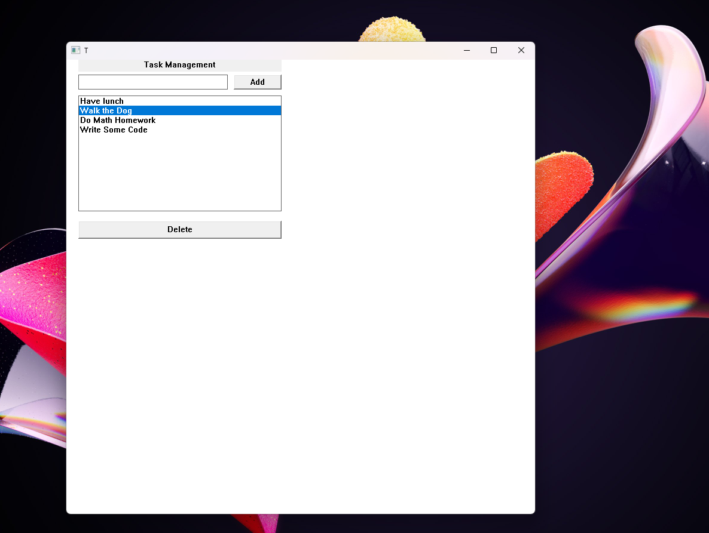

# MyDesk
Win32 GUI programming using C#.Net/Pinvoke and C++.

### Demos
#### Calculator 

#### Task Manager 
;
## Getting started
1. Project targets .NET10.0-sdk x64 which can be downloaded from  [.NET-SDK](https://dotnet.microsoft.com/en-us/download).
2. Navigate to Project folder & build MyDesk.sln
```
dotnet build 
