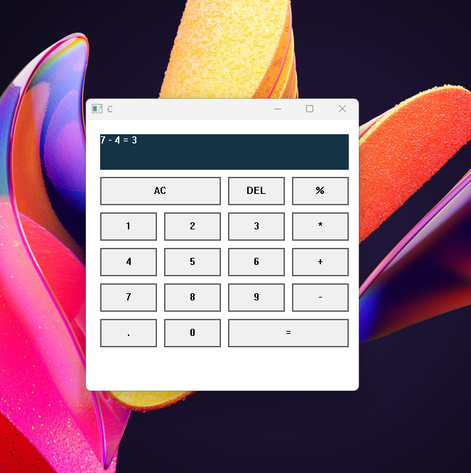

# MyDesk
This project is a personal productivity suite consisting of Windows Desktop Apps.
Also just to remind myself of the good old win32 gui programming using C#.Net/Pinvoke and C++.
### Calculator Demo 


## Getting started
1. Project targets .NET10.0-sdk x64 which can be downloaded from  [.NET-SDK](https://dotnet.microsoft.com/en-us/download).
2. Navigate to Project folder & build MyDesk.sln
```
dotnet build 
